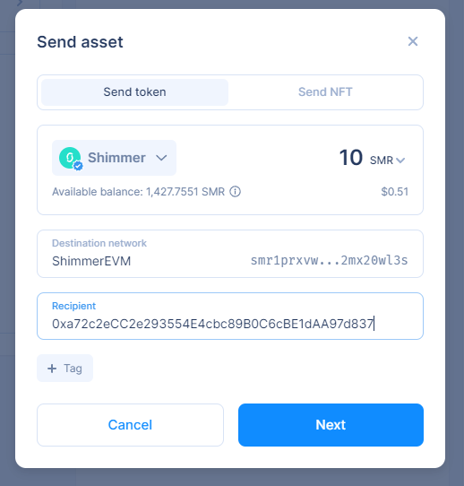

# Airdropping Badges

After you create an award, you have the ability to quickly airdrop all or some of the badges and corresponding tokens to predetermined MetaMask (ETH) addresses.

To do so, go into the award and click the "Give badges" button:

<figure><figcaption></figcaption></figure>

From there you'll download the CSV template:

<figure><figcaption></figcaption></figure>

Input all the MetaMask addresses you want to get a badge and tokens:

.png>)

Upload the completed CSV and then click "Confirm and Give badges":

<figure><figcaption></figcaption></figure>
